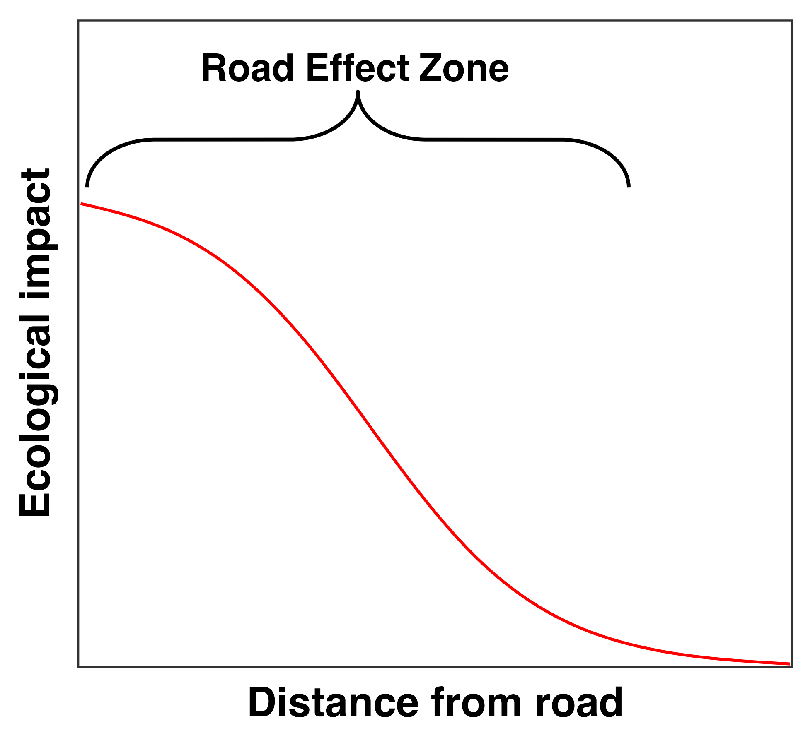

```{r setup, include=FALSE}
knitr::opts_chunk$set(echo = TRUE, fig.width=6, fig.height=6)
```

<br/>

1 – Department of Biology, The University of British Columbia, Okanagan Campus. \

<br/>

__\*Corresponding Author__: michael.noonan@ubc.ca \

<br/>

__Article type:__ Note


| <!-- -->                  |   | <!-- -->                   |
|---------------------------|---|----------------------------|
|                           |   |                            |
| Words in the abstract: XX |   | Number of Figures: 2      |
|                           |   |                            |
| Words in main text: 3,000 max    |   | Number of tables: 0       |
|                           |   |                            |
| Number of references: 150 max  |   | Supplementary material: 0 |

<br />

\newpage

# Abstract

__Keywords:__ Anthropogenic impacts, GPS tracking, Home range, Space use, Road ecology

# Introduction

The ca. 64,000,000 km of roads distributed across the globe are important for human socio-economic growth [@Ibisch:2016], but, although the area that roads occupy might be small, their ecological impacts can extend far beyond their physical footprint [@Forman:1998; @Forman:2003]. From an ecological perspective, roads and roadside ecotones are viewed high disturbance systems with non-natural chemical, physical, hydrological, and auditory properties [@Reijnen:1996; @Forman:1998; @Brady:2017]. Roads have been shown to alter population densities [@Reijnen:1996; @Andrasi:2021], community composition [@Truscott:2005], evolutionary trajectories [@Brown:2013; @Brady:2017], and are a serious source of non-natural mortality for many species [@Desbiez:2020; @Ascensao:2022]. Fully understanding the ecological footprint of roads is thus of the utmost importance if we are to design well-informed mitigation strategies.

The ecological impacts of roads are usually strongest directly on the road and they decay in intensity as the distance from the road increases. This relationship has given rise to the so called `Road Effect Zone' [@Forman:1998; @Forman:2000], which describes the distance up to which the ecological impact of a road can be measured (Fig. 1). Ecologists and conservation practitioners regularly quantify road effect zones for different species [e.g., @Semlitsch:2007; @Eigenbrod:2009; @Andrasi:2021], and these distances are often used to make conservation recommendations [e.g., @Peaden:2015]. Although this concept has proven useful in understanding the ecological consequences of roads, it is limited in that it only considers impacts on the focal species, and does not provide a framework for scaling up to population-, or community-level effects. Here, we re-frame the road effect zone as a joint probability and demonstrate how an animal's home range can be used to quantify the broader ecological cost of road induced mortality. Although our focus here is on motile animals, the concepts presented herein can be readily extended to other ecological processes.

<br/>
<p align="center">

</p>
<br/>


# The Road Effect Zone as a Joint Probability

Our purpose in this note is to demonstrate how probability theory can provide powerful tool for re-thinking the road effect zone. As noted above, our focus here is on motile animals, and so our framework begins from that starting point. An individual's home range describes the space it uses to undergo `_its normal activities of food gathering, mating, and caring for young_' [@Burt:1943he]. Ecologists have long recognised the utility of the home range concept in describing patterns of space use [e.g., @Kie:2010es], and routinely estimate animal home ranges through the process of home range estimation [see @AKDEvsKDE]. Statistically, home range estimation results in a probability distribution function (PDF) satisfying
\begin{equation}
\iint_{-\infty}^\infty \mathrm{Home~range}~dxdy = 1,
\end{equation}

which provides information on the locations where an animal is more, or less, likely to be found. Importantly, for the context of understanding the effects of roads on ecological processes, this PDF also represents the space over which an individual's ecological interactions (e.g., foraging, mating, defecating, engaging in territorial defence, etc.) are expected to occur. This PDF can thus be considered to be proportional to an animal's impact on the ecosystem, with core areas of the PDF being more heavily impacted than tail areas. Under the assumption that the probability of an animal being roadkilled $P\{\mathrm{Roadkilled}\}$ is proportional to the amount of time it spends on the road, we can also quantify $P\{\mathrm{Roadkilled}\}$ by integrating the home range PDF ($\mathrm{PDF_{HR}}$) over the area the falls on road surfaces
\begin{equation}
P\{\mathrm{Roadkilled}\} = \iint_{r}^{r^i} \mathrm{PDF_{HR}}~dxdy,
\end{equation}

where $r$ and $r^i$ represent the road margins. Similarly, the probability of an animal engaging in normal ecological interactions, $P\{\mathrm{Ecological~Interactions}\}$, is proportional to the amount of time it spends in locations other than on the road

\begin{equation}
P\{\mathrm{Ecological~Interactions}\} = \iint_{-\infty}^\infty \mathrm{PDF_{HR}}~dxdy - P\{\mathrm{Roadkilled}\}.
\end{equation}

The ecological ecological cost of a roadkilled animal not being able to engage in normal behaviour across its home range can thus be quantified via the joint probability of an animal encountering a vehicle on a road and being roadkilled $P\{\mathrm{Roadkilled}\}$ and the probability of an animal engaging in ecologically relevant behaviour $P\{\mathrm{Ecological~Interactions}\}$, or $P\{\mathrm{Roadkilled},\mathrm{Ecological~Interactions}\}$. Another way of seeing this is that $P\{\mathrm{Roadkilled},\mathrm{Ecological~Interactions}\}$ quantifies the probability of an animal engaging in normal behaviour after being roadkilled. Given that both of these events can not occur, $P\{\mathrm{Roadkilled},\mathrm{Ecological~Interactions}\}$ quantifies the road effect. Assuming independence, the road effect is thus given by:

\begin{equation}
P\{\mathrm{Road~Effect}\} = P\{\mathrm{Roadkilled},\mathrm{Ecological~Interactions}\} = P\{\mathrm{Roadkilled}\}P\{\mathrm{Ecological~Interactions}\}
\end{equation}

If an animal occupies a home range that is far away from a road $P\{\mathrm{Roadkilled}\}$ will be 0, resulting no road effect. Similarly, if an animal spends all of its time on roads, $P\{\mathrm{Roadkilled}\}$ may be high, but $P\{\mathrm{Ecological~Interactions}\}$ will be 0, also resulting in no road effect. For animals where $P\{\mathrm{Roadkilled}\} \neq 0$ and $P\{\mathrm{Ecological~Interactions}\} \neq 0$, however, the road effect will be some non-zero value with a strength that is a function of how much time an animal spends on roads relative to the rest of its home range. Notably, we can also integrate over areas of interest to calculate the local road effect. For instance, the road effect within some distance threshold of a road can be quantified as

\begin{equation}
\iint_{z}^{z^i} P\{\mathrm{Roadkilled},\mathrm{Ecological~Interactions}\}~dxdy,
\end{equation}

where $z$ and $z^i$ represent distance thresholds from the road edge. For instance, setting $z$ to 0m and $z^i$ to 1m would provide the `road effect' within 1m of the road edge.

# The Road Effect Zone for Giant Anteaters

Here, we demonstrate the utility of a probabilistic representation of the road effect zone on a pair of giant anteaters (_Myrmecophaga tridactyla_) from the Brazilian Cerrado. Giant anteaters are the largest extant anteater, reaching over 2 m and weighing up to 50kg [@McNab:1984] and are distributed throughout Central and South America [@Gardner:2008]. Giant anteater populations have suffered severe reductions and wildlife-vehicle-collisions are a major threat to their survival [@Ascensao:2021; @Noonan:2022b]. Wild giant anteaters were captured between 2017 and 2018, in the vicinity of the three paved highways in the state of Mato Grosso do Sul, in the Cerrado biome, and equipped with tracking collars that obtained GPS fixes at 20-min intervals [for full details see @Noonan:2022b]. A previous analysis on these data suggested these individuals occupied fixed (i.e. stationary) home ranges that regularly overlapped paved highways. Following the workflow described above, we estimated the road effect zone for these two individuals in \texttt{R} [ver. 4.2.1, @RAlanguageanden:2016wf]. The \texttt{R} scripts required to reproduce these analyses and estimate the road effect zone from animal tracking data are openly available at https://github.com/NoonanM/Road_Effect_Zone.

<br/>
<p align="center">
{width=80%}
</p>
<br/>

The two animals we estimated road effect zones for exhibited two different patterns in space use, with one animal occupying a home range that was centered on the road (Fig. 1A), whereas the other occupied the roadside, but spent little time on the road itself (Fig. 1B). As would be expected for an animal that lives right along the roadside, the ecological effects of a road mortality were greatest near the road (Fig. 1C). For the second animal, their home range was further from the road, resulting in a weaker overall road effect, but one that peaked in effect between 1-2km from the road (Fig. 1D).

# Discussion

# References

<div id="refs"></div>
